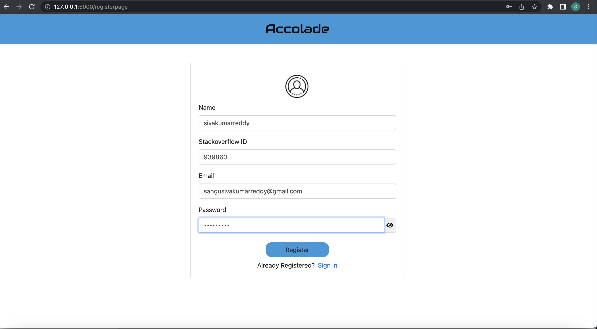
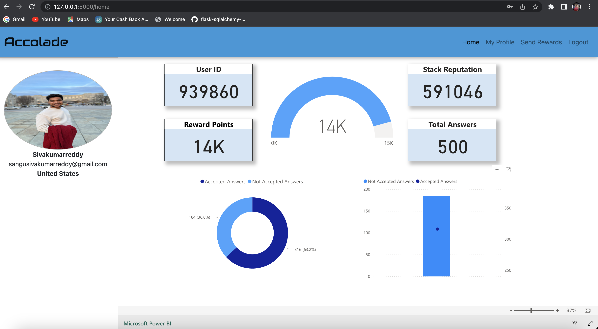

# Accolade

###### CS5704 - Software Engineering Project

###### Created By: [Sivakumarreddy Sangu][link-reference_1], [Akshay Reddy Narra][link-reference_2], [Samhitha Pentaparthy][link-reference_3], [Yaswanth Chakiri][link-reference_4]


## Project Description

Accolade application is a personalized and dynamic reward system that can effectively incentivize desired behaviours and increase user motivation. It will effectively track employee contributions, determine appropriate reward points, and provides analytics to measure employee performance and engagement. The application dynamically identifies employee contributions to open-source communities like stack overflow using the user ID and StackAPI library. Also, the application provides a kudos feature where colleagues can send rewards to each other. Finally, it consists of a reward analytics dashboard where employees and their managers can effectively keep track of contributions throughout time.

## Instructions

Download the .zip file from the backup folder. Alternaltively, you can choose to clone. Then unzip the file and install the requirements.

- Step 1: Download and install `Vs Code` from: https://code.visualstudio.com/download

- Step 2: To avoid any conflicts, we recommend using a virtual environment. You can create one by using the commands in Vs Code Terminal specified below.

```python 
python3 -m venv .venv
```

- Step 2: Install all the python packages using the requirements file.
```python
pip install -r requirements.txt
```

- Step 3: Download and install `python 3.8.8` from: https://www.python.org/downloads/release/python-388/

- Step 4: Download and install `Postgres` from: https://www.postgresql.org/download/

- Step 5: Open `postgres` and configure the database.

- Step 6: Start `postgres server` and run the `Create_Schema_DB.sql` script to initialize the database.

- Step 7: Start the Server.

Run the following commands in the directory: `CS5704-Accolade`

To start the Server:

``` python
python app.py
```

*Expected output:*

``` python
CS5704-Accolade % python app.py
* Serving Flask app 'app'
 * Debug mode: on
WARNING: This is a development server. Do not use it in a production deployment. Use a production WSGI server instead.
 * Running on http://127.0.0.1:5000
Press CTRL+C to quit
 * Restarting with stat
 * Debugger is active!
 * Debugger PIN: 971-903-612
```
*USE-CASE 1*
- Upload a video

  Once the system (Server) is up and running...

  step 1: Open this link: http://127.0.0.1:5000/ in a browser.

  step 2: Click on "signup" and Create a new account.

  step 3: Now "login" with the credentials, it will take you back to the Dashboard.



*Expected behaviour:* You can verify the rewards on the dashboard.



## Project Tracking

We tracked the project progress using KANBAN board and you can find it [here](https://github.com/users/sivakumarreddy07/projects/3) under the "Projects" section of the repository.

## System requirements

* Windows version  (or higher) or MacOS Catalina (or Higher).
* 64-bit Python 3.8.8 installation. We recommend installation through `pip` with numpy 1.19.2 or newer.
* postgres sql. 

## Study Materials

Flask - you can find out [here][link_reference_5]

Project Proposal - you can find out [here][link_reference_6] 


[link-reference_1]: https://github.com/sivakumarreddy07
[link-reference_2]: https://github.com/Akshay-06
[link-reference_3]: https://github.com/samhithapentaparthy
[link-reference_4]: https://github.com/yaswanth1316
[link_reference_5]: https://flask.palletsprojects.com/en/2.1.x/
[link_reference_6]: https://github.com/sivakumarreddy07/Accolade/blob/main/Accolade_Proposal.pdf
